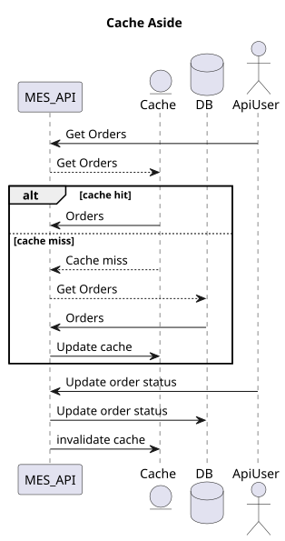

## Мотивация

Кеширование уменьшает нагрузку на базу данных или удалённые сервисы, следовательно, улучшает отзывчивость пользовательского интерфейса.

Кеширование помогает ускорить получение данных пользователями. Но при этом нужно сохранить консистентность данных, поэтому вместе с кешированием всегда выбирают и настраивают очистку кеша. 

Мы можем закешировать MES DB для MES API, а также сделать клиентское кеширование на MES UI, чтобы уменшить нагрузку на сам сервис

## Предлагаемое решение

Кэширование MES DB реализуем на MES API - серверное кэширование. Мы не контролируем интерфейс прямых пользователей MES API. 

Чтение страницы заказов будем кешировать по Cash-aside. Этот паттерн устойчив к ошибкам кеша, а также позволяет иметь другую схему данных, что может пригодиться, если мы будем переходить на no-SQL базу.

Диаграмма для cash-aside:

Кэш необходимо инвалидировать. Посмотрим на особенности типов инвалидации.

| По ключу	| По запросам |	На основе изменений | Программная |
|--|--|--|--|
|Позволяет точно определить данные, которые нуждаются в обновлении | Обеспечивает актуальность  в зависимости от активности пользователей| Для обновления данных в реальном времени|Позволяет гибко управлять инвалидацией кеша на основе логики приложения|
| |

Будем использовать стратегию инвалидации *на основе изменений*.
В системе MES изменения статусов уже введенных заказов уже под контролем оператора/продавца.
Операторы заинтересованы в новых заказах, поэтому, как только появляется новый заказ из CRM, имеет смысл инвалидировать кеш, чтобы страница заказов содержала все новые заказы.

Также можно использовать инвалидацию по времени (нет в таблице). Например раз в сутки, чтобы гарантировать появление новых заказов в течении 1 дня.